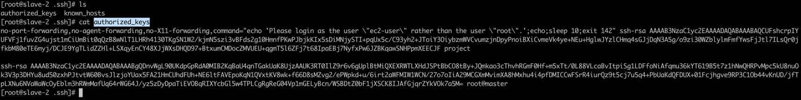
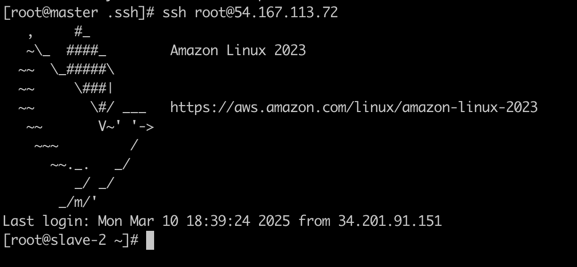
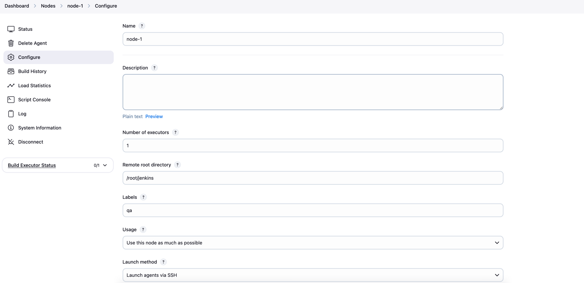
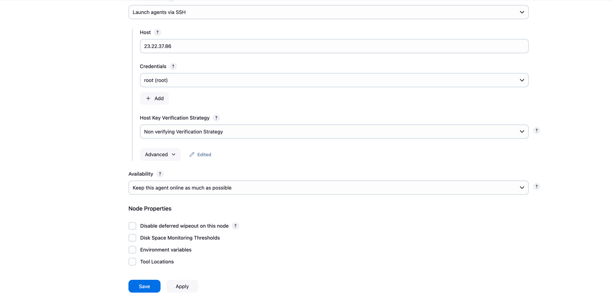

# How to Setup Jenkins Master and Slave on amzon-linux or any other servers

Jenkins is an automation server forked from the Hudson project. It has support for many SCM (Source Control Management) software systems including Git, SVN, and Mercurial. Jenkins provides hundreds of plugins to automate your project. Jenkins offers support for a master/slave' architecture, allowing it to host a large number of project builds

- note: This can be done in ubuntu as well but demo show in amazon-linux-2023
## Prerequisites
- Amazon Linux 2023 AMI
- Master and Slave node
- t2.medium
- Root privileges

## What we will do?
- Install Jenkins Master
- Configure Jenkins Master Credentials
- Configure Slave Agent Nodes
- Add New Slave Nodes
- Prepare Slave Agent Nodes to Execute Build
- Testing

- ref_doc: https://www.jenkins.io/doc/book/using/using-agents/

## Step 1 - Install Jenkins Master
```commandline
hostname master
```

```commandline
vi script.sh
```

```commandline
#!/bin/bash
#this works only on amaszon-linux or redhat
sudo wget -O /etc/yum.repos.d/jenkins.repo \
    https://pkg.jenkins.io/redhat-stable/jenkins.repo
sudo rpm --import https://pkg.jenkins.io/redhat-stable/jenkins.io-2023.key
sudo yum upgrade
# Add required dependencies for the jenkins package
sudo yum install java-17 -y 
sudo yum install jenkins -y
sudo systemctl daemon-reload
sudo systemctl enable jenkins
sudo systemctl start jenkins
sudo systemctl status jenkins
```


### Generating the ssh keys in the master 
```commandline
ssh-keygen
```
```commandline
[root@master .ssh]# ls
authorized_keys  id_rsa  id_rsa.pub  known_hosts
```

## Step 2 - Setup Credentials on Jenkins

- copy **id_rsa** key to Jenkins application credentials 
- copy **id_rsa.pub** to slave server to **authorized_keys**
### Kind: SSH Username with private key




From master try to access slave node



## In all the slave nodes java must be same and should match
```commandline
[root@slave-2 ~]# sudo yum install java-17 -y
Amazon Linux 2023 Kernel Livepatch repository                                                                                                                                         109 kB/s |  14 kB     00:00
Dependencies resolved.
```
### Master Node:
```commandline
[root@master .ssh]# java --version
openjdk 17.0.14 2025-01-21 LTS
OpenJDK Runtime Environment Corretto-17.0.14.7.1 (build 17.0.14+7-LTS)
OpenJDK 64-Bit Server VM Corretto-17.0.14.7.1 (build 17.0.14+7-LTS, mixed mode, sharing)
```

````commandline
[root@slave-2 .ssh]# java --version
openjdk 17.0.14 2025-01-21 LTS
OpenJDK Runtime Environment Corretto-17.0.14.7.1 (build 17.0.14+7-LTS)
OpenJDK 64-Bit Server VM Corretto-17.0.14.7.1 (build 17.0.14+7-LTS, mixed mode, sharing)
````
Step 3 - Add New Slave Nodes



