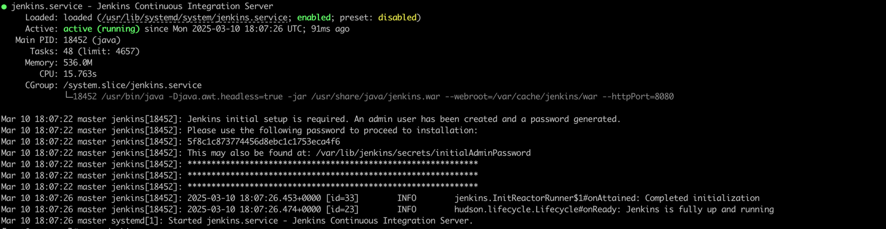

# Understanding Kubernetes Fundamentals
### EKS vs. Self-Managed Kubernetes: Pros and Cons
**1. EKS (Amazon Elastic Kubernetes Service) Pros:**

    1.1 Managed Control Plane:EKS takes care of managing the Kubernetes control plane components,
        such as the API server, controller manager, and etcd. AWS handles upgrades, patches, and ensures high availability of the control plane.
    1.2 Automated Updates: EKS automatically updates the Kubernetes version, 
        eliminating the need for manual intervention and ensuring that the cluster stays up-to-date with the latest features and security patches.
    1.3 Scalability: EKS can automatically scale the Kubernetes control plane based on demand, 
        ensuring the cluster remains responsive as the workload increases.
    1.4 AWS Integration: EKS seamlessly integrates with various AWS services, such as AWS IAM for authentication and authorization, 
        Amazon VPC for networking, and AWS Load Balancers for service exposure.
    1.5 Security and Compliance: EKS is designed to meet various security standards and compliance requirements, 
        providing a secure and compliant environment for running containerized workloads.
    1.6 Monitoring and Logging: EKS integrates with AWS CloudWatch for monitoring cluster health and performance metrics, 
        making it easier to track and troubleshoot issues.
    1.7 Ecosystem and Community: Being a managed service, EKS benefits from continuous improvement, support, 
        and contributions from the broader Kubernetes community.

**Cons:**

    1.1 Cost: EKS is a managed service, and this convenience comes at a cost. 
              Running an EKS cluster may be more expensive compared to self-managed Kubernetes, especially for large-scale deployments.
    1.2 Less Control: While EKS provides a great deal of automation, 
              it also means that you have less control over the underlying infrastructure and some Kubernetes configurations.


**2. Self-Managed Kubernetes on EC2 Instances Pros:**

    2.1 Cost-Effective: Self-managed Kubernetes allows you to take advantage of EC2 spot instances and reserved instances, 
        potentially reducing the overall cost of running Kubernetes clusters.
    2.2 Flexibility: With self-managed Kubernetes, you have full control over the cluster's configuration and infrastructure, 
        enabling customization and optimization for specific use cases.
    2.3 EKS-Compatible: Self-managed Kubernetes on AWS can still leverage various AWS services and features, 
        enabling integration with existing AWS resources.
    2.4 Experimental Features: Self-managed Kubernetes allows you to experiment with the latest Kubernetes features and versions 
        before they are officially supported by EKS.
# Deployed applications on Amazon EKS 
1. Deployed applications on Amazon EKS by utilizing Ingress controllers for managing routing and traffic distribution to services, ensuring high availability and scalability in a microservices architecture.
2. Implemented AWS ALB (Application Load Balancer) Controller to automate the creation and management of ALBs, enabling efficient routing of HTTP/HTTPS traffic to Kubernetes pods.
3. Used eksctl to streamline the setup and management of Amazon EKS clusters, ensuring simplified cluster creation, management, and configuration.
4. Managed Git repositories for version control and collaboration on Kubernetes deployment configurations, Helm charts, and CI/CD pipelines.
5. Designed and implemented Kubernetes deployments for containerized applications, ensuring smooth rolling updates, scaling, and reliable deployments in the EKS environment.
6. Configured Ingress resources to enable external access to internal services running in EKS, ensuring seamless connectivity with the ALB controller for traffic management.
7. Integrated CI/CD pipelines to automate the deployment process, utilizing Git, Kubernetes, and AWS services for efficient development workflows and faster release cycles.
8. Optimized application routing and load balancing by tuning ALB settings for path-based routing, SSL termination, and WebSocket support, enhancing performance and security.


## Setting up your AWS Environment for EKS

**Pre-requisites:**
an EC2 Instance
Install AWSCLI latest verison

# Setup Kubernetes on Amazon EKS

You can follow same procedure in the official  AWS document [Getting started with Amazon EKS – eksctl](https://docs.aws.amazon.com/eks/latest/userguide/getting-started-eksctl.html)   

#### Pre-requisites: 
- an EC2 Instance 
  - Install AWSCLI latest verison
    ```
    apt install unzip -y
    curl "https://awscli.amazonaws.com/awscli-exe-linux-x86_64.zip" -o "awscliv2.zip"
    unzip awscliv2.zip
    sudo ./aws/install
    ```
  - configure the aws 
    ```commandline
    root@ip-172-31-22-54:~# aws configure
    AWS Access Key ID [None]: xxx
    AWS Secret Access Key [None]: xx
    Default region name [None]: us-east-1
    Default output format [None]: json
    ```

1. Setup kubectl   
   a. Download kubectl version latest 
   b. Grant execution permissions to kubectl executable   
   c. Move kubectl onto /usr/local/bin   
   d. Test that your kubectl installation was successful    

   ```sh 
   curl -LO "https://dl.k8s.io/release/$(curl -L -s https://dl.k8s.io/release/stable.txt)/bin/linux/amd64/kubectl"
   chmod +x ./kubectl
   mv ./kubectl /usr/local/bin 
   kubectl version --client
   ```
2. Setup eksctl   
   a. Download and extract the latest release   
   b. Move the extracted binary to /usr/local/bin   
   c. Test that your eksclt installation was successful   

   ```sh
   curl --silent --location "https://github.com/weaveworks/eksctl/releases/latest/download/eksctl_$(uname -s)_amd64.tar.gz" | tar xz -C /tmp
   sudo mv /tmp/eksctl /usr/local/bin
   eksctl version
   ```
3. Install EKS:
    ```
   eksctl create cluster --name microdegree --region us-east-1 --fargate
   ```
4. Delete the EKS:
    ```
   eksctl delete cluster --name microdegree --region us-east-1
   ```
5. Update the kubeconfig:

    ```
   aws eks update-kubeconfig --name microdegree --region us-east-1
   ```
6. Creating new Fargate profile
    ```commandline
    eksctl create fargateprofile \
        --cluster microdegree \
        --region us-east-1 \
        --name alb-sample-app \
        --namespace game-2048
    ```
   
    We can check for new profile added here.
7. Deploying the application:
    ```commandline
    kubectl apply -f https://raw.githubusercontent.com/kubernetes-sigs/aws-load-balancer-controller/v2.5.4/docs/examples/2048/2048_full.yaml
    ```
    ```commandline
    namespace/game-2048 created
    deployment.apps/deployment-2048 created
    service/service-2048 created
    ingress.networking.k8s.io/ingress-2048 created
    ```
    ```commandline
     kubectl get pods -n game-2048
    NAME                              READY   STATUS    RESTARTS   AGE
    deployment-2048-85f8c7d69-5m6j9   1/1     Running   0          2m54s
    deployment-2048-85f8c7d69-6vvb4   1/1     Running   0          2m54s
    deployment-2048-85f8c7d69-bqq8l   1/1     Running   0          2m54s
    deployment-2048-85f8c7d69-smqzf   1/1     Running   0          2m54s
    deployment-2048-85f8c7d69-w85g5   1/1     Running   0          2m54s
    ```
    ```commandline
    kubectl get svc -n game-2048
    NAME           TYPE       CLUSTER-IP      EXTERNAL-IP   PORT(S)        AGE
    service-2048   NodePort   10.100.48.251   <none>        80:31975/TCP   7m46s
    ```   
    ```commandline
    kubectl get ingress -n game-2048
    NAME           CLASS   HOSTS   ADDRESS   PORTS   AGE
    ingress-2048   alb     *                 80      8m24s
    ```

    

    ```commandline
    export cluster_name=microdegree
    ```
    ```
   eksctl utils associate-iam-oidc-provider --cluster microdegree --approve
   ```        
   
    ```commandline
    2025-03-02 06:30:12 [ℹ]  will create IAM Open ID Connect provider for cluster "demo-cluster" in "us-east-1"
    2025-03-02 06:30:12 [✔]  created IAM Open ID Connect provider for cluster "demo-cluster" in "us-east-1"
    ```


Incase if policy deleted attach this below policy in manual way

- Policy name: AWSLoadBalancerControllerIAMPolicy

```json
{
    "Version": "2012-10-17",
    "Statement": [
        {
            "Effect": "Allow",
            "Action": [
                "ec2:DescribeSecurityGroups",
                "ec2:CreateSecurityGroup",
                "ec2:DeleteSecurityGroup",
                "ec2:DescribeInstances",
                "ec2:DescribeSubnets",
                "ec2:DescribeVpcs",
                "ec2:DescribeRouteTables",
                "ec2:DescribeNetworkInterfaces",
                "elasticloadbalancing:CreateLoadBalancer",
                "elasticloadbalancing:DeleteLoadBalancer",
                "elasticloadbalancing:DescribeLoadBalancers",
                "elasticloadbalancing:ModifyLoadBalancerAttributes",
                "elasticloadbalancing:CreateTargetGroup",
                "elasticloadbalancing:DeleteTargetGroup",
                "elasticloadbalancing:DescribeTargetGroups",
                "elasticloadbalancing:RegisterTargets",
                "elasticloadbalancing:DeregisterTargets",
                "iam:PassRole",
                "autoscaling:DescribeAutoScalingGroups",
                "autoscaling:DescribeLaunchConfigurations",
                "autoscaling:DescribeAutoScalingInstances",
                "acm:DescribeCertificate",
                "acm:ListCertificates"
            ],
            "Resource": "*"
        }
    ]
}
```

## Deploy ALB controller
- Addding helm repo:
Download IAM policy
```commandline
curl -O https://raw.githubusercontent.com/kubernetes-sigs/aws-load-balancer-controller/v2.11.0/docs/install/iam_policy.json
```
- Create IAM Policy
```commandline
aws iam create-policy \
    --policy-name AWSLoadBalancerControllerIAMPolicy \
    --policy-document file://iam_policy.json
```
Create IAM Role
```commandline
eksctl create iamserviceaccount \
  --cluster=<your-cluster-name> \
  --namespace=kube-system \
  --name=aws-load-balancer-controller \
  --role-name AmazonEKSLoadBalancerControllerRole \
  --attach-policy-arn=arn:aws:iam::<your-aws-account-id>:policy/AWSLoadBalancerControllerIAMPolicy \
  --approve
```

```commandline
helm repo add eks https://aws.github.io/eks-charts
```
- Update the repo
```commandline
helm repo update eks
```
- Install
```commandline
helm install aws-load-balancer-controller eks/aws-load-balancer-controller \            
  -n kube-system \
  --set clusterName=<your-cluster-name> \
  --set serviceAccount.create=false \
  --set serviceAccount.name=aws-load-balancer-controller \
  --set region=<region> \
  --set vpcId=<your-vpc-id>

```
- Verify that the deployments are running
```commandline
kubectl get deployment -n kube-system aws-load-balancer-controller
```
```commandline
kubectl get ingress -n  game-2048
```

